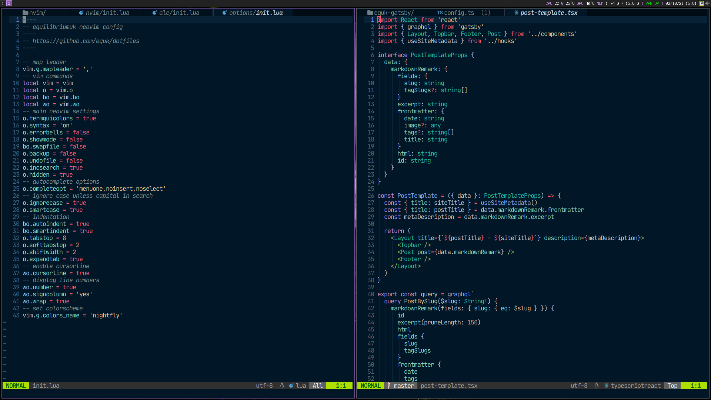

# neovim-lua

Migrating neovim config to lua

Testing neovim 0.5 features

## Screenshot



## Features

- [x] Plugins Managed Using Packer
- [x] ripgrep
- [x] telescope
- [x] Neovim LSP
- [x] LSP + Snippet Autocomplete
- [x] rust-analyzer lsp (Rust)
- [x] gopls lsp (Golang)
- [x] tsserver lsp (Typescript, Javascript)
- [x] lightline with powerline colors
- [x] snippets integration with cmp
- [x] add language specific config for LSP (`Go`, `Javascript`, `TypeScript`, `Rust`, `lua`)
- [x] treesitter for syntax highlighting

## Extras

- [x] Packer installer (https://github.com/tjdevries/config_manager)

## TODO

- [ ] set transparency (guibg=NONE) using lua
- [ ] linter on save

old linter setup using ALE

```
let g:ale_linters = {'rust': ['analyzer'], 'go': ['golint', 'gofmt'], 'javascript': ['eslint'],'CloudFormation' : ['cfn-lint']}
let g:ale_fixers = {'rust': ['rustfmt'], 'javascript': ['eslint'], 'json': ['jq']}
```
- [ ] set current keybindings in lua
- [ ] set language specific indent settings

